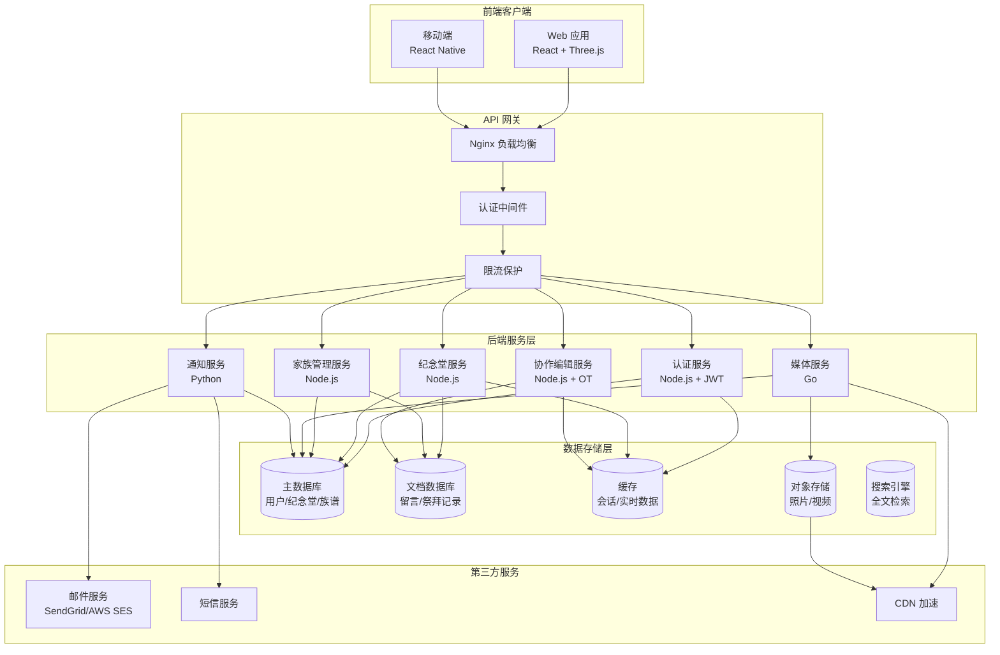

# 亲人纪念堂技术设计

Feature Name: family-memorial-hall
Updated: 2026-06-03

## Description

亲人纪念堂是一个面向家族内部成员的私密性线上纪念空间，采用前后端分离架构，支持 3D 虚拟场景祭拜、家族族谱管理、生平故事协作编辑、多媒体展示以及忌日提醒等功能。系统使用 Three.js 实现 3D 场景渲染，采用 WebSocket 实现实时协作编辑，通过微服务架构保证系统的可扩展性和高可用性。

## Architecture



### 架构说明

1. **前端层**: 使用 React + Three.js 构建 Web 应用，React Native 构建移动端应用，实现 3D 场景渲染和交互
2. **网关层**: Nginx 作为反向代理和负载均衡器，集成认证和限流中间件保护后端服务
3. **服务层**: 采用微服务架构，6 个独立服务分别处理认证、纪念堂、家族管理、媒体、通知和协作编辑
4. **数据层**: 多类型数据库组合，PostgreSQL 存储关系型数据，MongoDB 存储文档数据，Redis 缓存热点数据，MinIO 存储媒体文件
5. **第三方服务**: 集成邮件、短信和 CDN 服务提供通知和内容分发能力

## Components and Interfaces

### 1. 认证服务 (AuthService)

**职责**: 用户注册、登录、权限验证、JWT 令牌管理

**接口定义**:
```typescript
interface AuthService {
  register(request: RegisterRequest): Promise<RegisterResponse>;
  login(request: LoginRequest): Promise<LoginResponse>;
  refreshToken(token: string): Promise<TokenResponse>;
  validateToken(token: string): Promise<UserInfo>;
  inviteMember(request: InviteRequest): Promise<void>;
  removeMember(userId: string): Promise<void>;
}
```

### 2. 纪念堂服务 (MemorialService)

**职责**: 纪念堂 CRUD、祭拜动作处理、祭拜记录管理

**接口定义**:
```typescript
interface MemorialService {
  createMemorial(request: CreateMemorialRequest): Promise<Memorial>;
  getMemorial(memorialId: string): Promise<MemorialDetail>;
  updateMemorial(request: UpdateMemorialRequest): Promise<void>;
  performRitual(request: RitualRequest): Promise<RitualRecord>;
  getRitualRecords(memorialId: string, filter: Filter): Promise<RitualRecord[]>;
  getStatistics(memorialId: string): Promise<RitualStatistics>;
}
```

### 3. 家族管理服务 (FamilyService)

**职责**: 家族成员管理、族谱构建与维护、权限控制

**接口定义**:
```typescript
interface FamilyService {
  addFamilyMember(request: AddMemberRequest): Promise<FamilyMember>;
  getFamilyTree(familyId: string): Promise<FamilyTree>;
  updateMemberRelation(request: UpdateRelationRequest): Promise<void>;
  markDeceased(memberId: string, memorialId: string): Promise<void>;
  getMembers(familyId: string): Promise<FamilyMember[]>;
}
```

### 4. 媒体服务 (MediaService)

**职责**: 照片视频上传下载、转码处理、CDN 分发

**接口定义**:
```typescript
interface MediaService {
  uploadMedia(request: UploadRequest): Promise<MediaInfo>;
  downloadMedia(mediaId: string): Promise<Stream>;
  deleteMedia(mediaId: string): Promise<void>;
  getMediaList(memorialId: string, type: MediaType): Promise<MediaInfo[]>;
  generateThumbnail(mediaId: string): Promise<string>;
}
```

### 5. 通知服务 (NotifyService)

**职责**: 忌日提醒调度、邮件发送、站内通知管理

**接口定义**:
```typescript
interface NotifyService {
  scheduleDeathAnniversaryReminder(memberId: string): Promise<void>;
  cancelReminder(reminderId: string): Promise<void>;
  sendEmail(request: EmailRequest): Promise<void>;
  sendInAppNotification(request: NotificationRequest): Promise<void>;
  getNotifications(userId: string): Promise<Notification[]>;
  markAsRead(notificationId: string): Promise<void>;
}
```

### 6. 协作编辑服务 (CollaborativeService)

**职责**: 生平故事实时协作、版本控制、冲突解决

**接口定义**:
```typescript
interface CollaborativeService {
  joinEditingRoom(memorialId: string, userId: string): Promise<WebSocket>;
  saveVersion(memorialId: string, content: string, userId: string): Promise<Version>;
  getVersions(memorialId: string): Promise<Version[]>;
  restoreVersion(versionId: string): Promise<void>;
  resolveConflict(memorialId: string, strategy: MergeStrategy): Promise<void>;
}
```

## Data Models

### 1. 用户 (User)

```typescript
interface User {
  id: string;                    // UUID
  email: string;                 // 邮箱地址
  passwordHash: string;          // 密码哈希
  nickName: string;              // 昵称
  avatar: string;                // 头像 URL
  roleId: string;                // 角色 ID (管理员/普通成员)
  familyId: string;              // 所属家族 ID
  status: UserStatus;            // ACTIVE, LOCKED, DISABLED
  failedLoginAttempts: number;   // 失败登录次数
  lockUntil: Date | null;        // 锁定截止时间
  createdAt: Date;
  updatedAt: Date;
}
```

### 2. 纪念堂 (Memorial)

```typescript
interface Memorial {
  id: string;                    // UUID
  deceasedId: string;            // 逝者 ID (家族成员)
  familyId: string;              // 家族 ID
  name: string;                  // 纪念堂名称
  sceneType: SceneType;          // HALL(祠堂), TOMBSTONE(墓碑)
  sceneConfig: SceneConfig;      // 3D 场景配置
  biography: string;             // 生平故事 (富文本)
  birthDate: Date;               // 出生日期
  deathDate: Date;               // 逝世日期
  deathAnniversary: string;      // 忌日 (MM-DD)
  totalRitualCount: number;      // 累计祭拜次数
  todayRitualCount: number;      // 今日祭拜次数
  storageUsed: number;           // 已用存储空间 (字节)
  storageQuota: number;          // 存储配额 (字节，默认 10GB)
  createdAt: Date;
  updatedAt: Date;
}
```

### 3. 家族成员 (FamilyMember)

```typescript
interface FamilyMember {
  id: string;                    // UUID
  familyId: string;              // 家族 ID
  userId: string | null;         // 关联用户 ID (已故为 null)
  name: string;                  // 姓名
  gender: Gender;                // MALE, FEMALE
  birthDate: Date | null;        // 出生日期
  deathDate: Date | null;        // 逝世日期
  isDeceased: boolean;           // 是否已故
  memorialId: string | null;     // 关联纪念堂 ID
  parentId: string | null;       // 父亲 ID
  motherId: string | null;       // 母亲 ID
  spouseId: string | null;       // 配偶 ID
  generation: number;            // 第几代
  sortOrder: number;             // 同级排序
  biography: string;             // 个人简介
  createdAt: Date;
  updatedAt: Date;
}
```

### 4. 祭拜记录 (RitualRecord)

```typescript
interface RitualRecord {
  id: string;                    // UUID
  memorialId: string;            // 纪念堂 ID
  userId: string;                // 用户 ID
  ritualType: RitualType;        // FLOWER, CANDLE, INCENSE, BOW, OFFERING
  ritualData: RitualData;        // 祭拜数据 (花束类型、祭品等)
  message: string | null;        // 祭拜留言
  createdAt: Date;               // 祭拜时间
}
```

### 5. 留言 (Message)

```typescript
interface Message {
  id: string;                    // UUID
  memorialId: string;            // 纪念堂 ID
  userId: string;                // 留言者 ID
  content: string;               // 留言内容
  isEdited: boolean;             // 是否已编辑
  createdAt: Date;
  updatedAt: Date;
}
```

### 6. 媒体文件 (Media)

```typescript
interface Media {
  id: string;                    // UUID
  memorialId: string;            // 纪念堂 ID
  userId: string;                // 上传者 ID
  type: MediaType;               // PHOTO, VIDEO
  url: string;                   // CDN URL
  thumbnailUrl: string | null;   // 缩略图 URL
  fileName: string;              // 原始文件名
  fileSize: number;              // 文件大小 (字节)
  mimeType: string;              // MIME 类型
  description: string | null;    // 说明文字
  captureDate: Date | null;      // 拍摄时间
  sortOrder: number;             // 排序顺序
  createdAt: Date;
}
```

### 7. 提醒 (Reminder)

```typescript
interface Reminder {
  id: string;                    // UUID
  memorialId: string;            // 纪念堂 ID
  deceasedId: string;            // 逝者 ID
  type: ReminderType;            // EMAIL, IN_APP, BOTH
  scheduleDate: Date;            // 计划发送日期
  sentAt: Date | null;           // 实际发送时间
  status: ReminderStatus;        // PENDING, SENT, FAILED
  retryCount: number;            // 重试次数
  createdAt: Date;
}
```

## Correctness Properties

### 1. 权限不变性

- 任意时刻，未登录用户不能访问任何纪念堂数据
- 只有家族成员可以访问本家族的纪念堂
- 只有管理员可以邀请或移除家族成员

### 2. 数据一致性

- 每个已故家族成员必须有且仅有一个纪念堂
- 祭拜记录的 memorialId 必须引用存在的纪念堂
- 媒体文件的总大小不能超过纪念堂的存储配额

### 3. 提醒调度约束

- 每个逝者的忌日提醒必须在忌日前 7 天和当天各发送一次
- 提醒发送时间固定为上午 9:00 (用户时区)
- 失败提醒最多重试 3 次，每次间隔 1 小时

### 4. 协作编辑约束

- 任意时刻，同一纪念堂的生平故事只能有一个最终版本
- 版本历史必须完整保存，支持回溯到任意历史版本
- 编辑冲突必须在 5 分钟内解决或提示用户手动处理

## Error Handling

### 1. 认证错误

| 错误场景 | HTTP 状态码 | 错误码 | 处理策略 |
|---------|-----------|-------|---------|
| 无效凭证 | 401 | AUTH_INVALID_CREDENTIAL | 返回通用错误信息，不暴露具体原因 |
| 账号锁定 | 403 | AUTH_ACCOUNT_LOCKED | 提示锁定剩余时间 |
| Token 过期 | 401 | AUTH_TOKEN_EXPIRED | 自动刷新 token 或要求重新登录 |
| 无权限访问 | 403 | AUTH_FORBIDDEN | 返回无权限提示 |

### 2. 业务错误

| 错误场景 | HTTP 状态码 | 错误码 | 处理策略 |
|---------|-----------|-------|---------|
| 纪念堂不存在 | 404 | MEMORIAL_NOT_FOUND | 返回纪念堂不存在提示 |
| 存储空间不足 | 400 | MEDIA_STORAGE_EXCEEDED | 提示清理空间或联系管理员 |
| 文件过大 | 400 | MEDIA_FILE_TOO_LARGE | 提示文件大小限制 |
| 族谱关系冲突 | 400 | FAMILY_RELATION_CONFLICT | 详细说明冲突原因 |
| 协作编辑冲突 | 409 | COLLAB_CONFLICT | 提供版本对比和合并选项 |

### 3. 系统错误

| 错误场景 | HTTP 状态码 | 错误码 | 处理策略 |
|---------|-----------|-------|---------|
| 数据库连接失败 | 500 | DB_CONNECTION_ERROR | 记录日志，返回系统繁忙提示 |
| 邮件发送失败 | 500 | EMAIL_SEND_FAILED | 加入重试队列，最多重试 3 次 |
| 3D 资源加载失败 | 500 | SCENE_LOAD_ERROR | 降级到 2D 场景展示 |

### 4. 全局错误处理

```typescript
// 全局错误中间件示例
app.use((err: Error, req: Request, res: Response, next: NextFunction) => {
  const errorLogger = getLogger('error');
  errorLogger.error({
    error: err.message,
    stack: err.stack,
    path: req.path,
    method: req.method,
    userId: req.user?.id,
    timestamp: new Date().toISOString()
  });
  
  if (err instanceof BusinessException) {
    return res.status(err.statusCode).json({
      code: err.errorCode,
      message: err.message,
      details: err.details
    });
  }
  
  // 未知错误返回通用 500
  return res.status(500).json({
    code: 'INTERNAL_ERROR',
    message: '系统繁忙，请稍后再试'
  });
});
```

## Test Strategy

### 1. 单元测试

**覆盖范围**:
- 所有服务层业务逻辑
- 数据访问层 CRUD 操作
- 工具函数和验证逻辑

**技术栈**: Jest (Node.js), Pytest (Python)

**示例**:
```typescript
describe('MemorialService', () => {
  describe('performRitual', () => {
    it('should create ritual record when user performs ritual', async () => {
      const ritual = await service.performRitual({
        memorialId: 'mem-001',
        userId: 'user-001',
        ritualType: 'FLOWER',
        ritualData: { flowerType: 'rose', color: 'white' }
      });
      
      expect(ritual).toBeDefined();
      expect(ritual.memorialId).toBe('mem-001');
      expect(ritual.ritualType).toBe('FLOWER');
    });
    
    it('should increment todayRitualCount after ritual', async () => {
      const memorial = await memorialRepo.findById('mem-001');
      const initialCount = memorial.todayRitualCount;
      
      await service.performRitual({ memorialId: 'mem-001', userId: 'user-001', ritualType: 'BOW' });
      
      const updated = await memorialRepo.findById('mem-001');
      expect(updated.todayRitualCount).toBe(initialCount + 1);
    });
  });
});
```

### 2. 集成测试

**覆盖范围**:
- API 端到端测试
- 数据库操作集成
- 第三方服务集成 (邮件、短信)

**技术栈**: Supertest, Testcontainers

**示例**:
```typescript
describe('POST /api/memorials/:id/rituals', () => {
  it('should perform ritual and return 201', async () => {
    const token = await login('user@example.com', 'password');
    
    const response = await request(app)
      .post('/api/memorials/mem-001/rituals')
      .set('Authorization', `Bearer ${token}`)
      .send({
        ritualType: 'CANDLE',
        ritualData: { candleType: 'long lasting' }
      });
    
    expect(response.status).toBe(201);
    expect(response.body.ritualType).toBe('CANDLE');
  });
  
  it('should return 403 when non-family member tries', async () => {
    const token = await login('outsider@example.com', 'password');
    
    const response = await request(app)
      .post('/api/memorials/mem-001/rituals')
      .set('Authorization', `Bearer ${token}`)
      .send({ ritualType: 'FLOWER' });
    
    expect(response.status).toBe(403);
  });
});
```

### 3. E2E 测试

**覆盖范围**:
- 用户完整祭拜流程
- 协作编辑实时同步
- 忌日提醒完整链路

**技术栈**: Playwright, Cypress

**示例**:
```typescript
test('user can perform full ritual flow', async ({ page }) => {
  await page.goto('/login');
  await page.fill('[name="email"]', 'user@example.com');
  await page.fill('[name="password"]', 'password');
  await page.click('button[type="submit"]');
  
  await page.waitForURL('/memorials/mem-001');
  
  // 验证 3D 场景加载
  await page.waitForSelector('#scene-container canvas');
  
  // 执行献花动作
  await page.click('[data-action="offer-flower"]');
  await page.click('[data-flower-type="chrysanthemum"]');
  await page.click('[data-action="confirm"]');
  
  // 验证祭拜成功提示
  await page.waitForSelector('.ritual-success-toast');
  
  // 验证祭拜记录更新
  const todayCount = await page.textContent('.today-ritual-count');
  expect(parseInt(todayCount)).toBeGreaterThan(0);
});
```

### 4. 性能测试

**测试场景**:
- 并发祭拜请求 (1000 用户同时祭拜)
- 族谱加载性能 (1000 节点家族树)
- 媒体文件上传性能 (大文件并发上传)

**技术栈**: k6, JMeter

**性能指标**:
- API 响应时间 P95 < 200ms
- 3D 场景加载时间 < 3s
- 协作编辑延迟 < 100ms
- 忌日提醒送达率 > 99%

### 5. 安全测试

**测试内容**:
- SQL 注入防护
- XSS 攻击防护
- CSRF Token 验证
- JWT Token 安全性
- 权限绕过测试
- 暴力破解防护

**技术栈**: OWASP ZAP, Burp Suite

## References

[^1]: (Three.js Documentation) - [3D Graphics Library](https://threejs.org/docs/)
[^2]: (Operational Transform) - [Real-time Collaboration Algorithm](https://operational-transformation.github.io/)
[^3]: (MinIO) - [S3 Compatible Object Storage](https://min.io/docs/minio/linux/index.html)
[^4]: (INCOSE Systems Engineering Handbook) - [Requirements Quality Guidelines](https://www.incose.org/)
